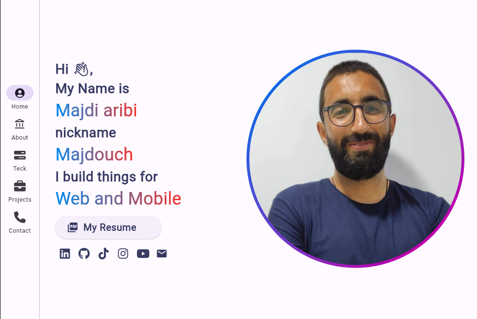
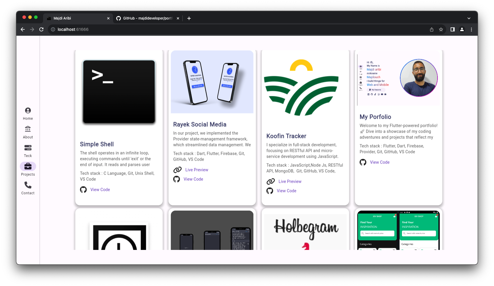
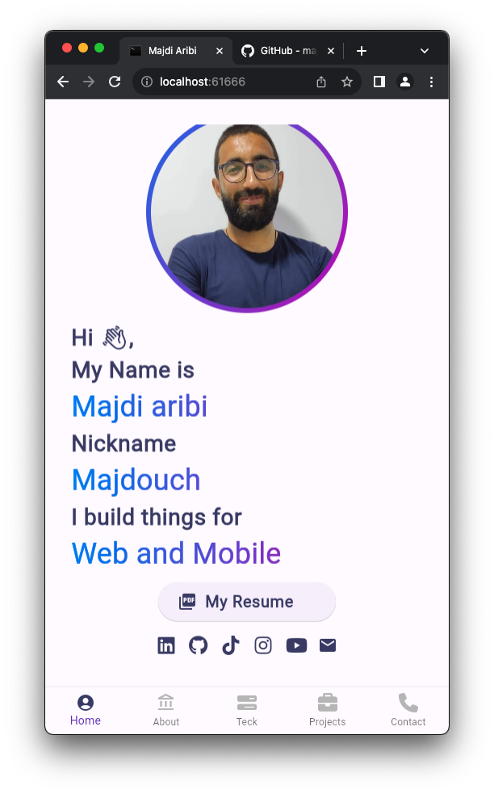
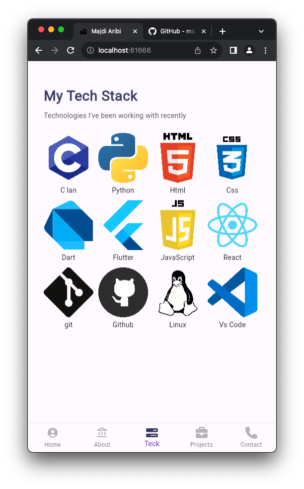
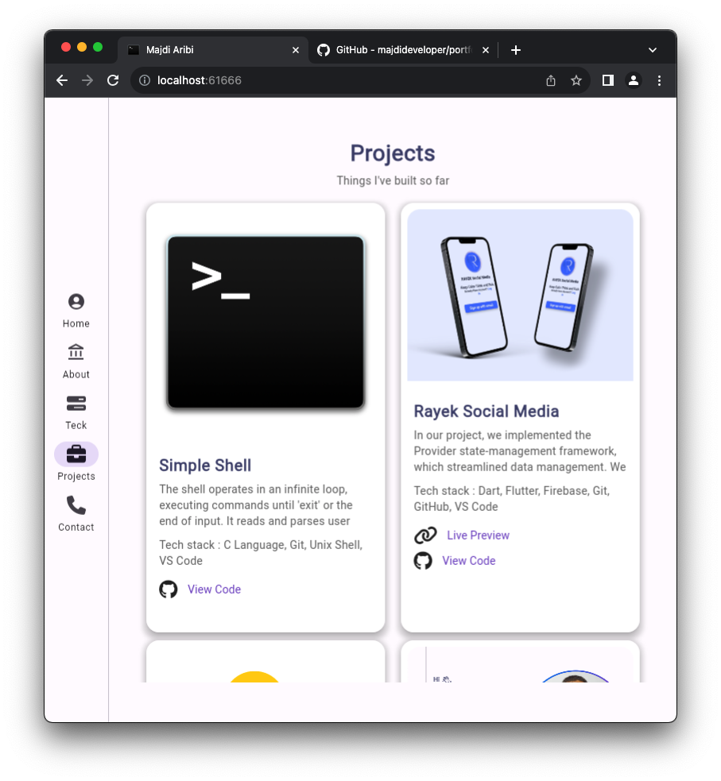
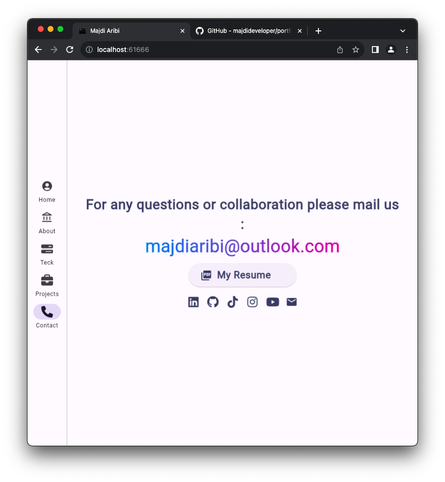

  
  <center><h1>Portfolio Majdouch</h1>
  
  </center>
  
  

   


<br />
<!-- Introduction-->


## Introduction:
Welcome to my world of responsive wonders! 🌐✨ In my portfolio, I've crafted a dynamic showcase of diverse projects, each a testament to my commitment to responsive design and innovative solutions. From mobile-friendly apps to desktop delights, every project is a journey into the realm of seamless user experiences. Whether it's creating captivating visuals, optimizing for various screen sizes, or ensuring smooth navigation, my portfolio is a testament to the art of responsiveness. Join me on this adventure where design meets functionality, and every project is a pixel-perfect testament to the power of responsive design! 📱💻🚀


## :wrench: Instalation:
Clone the repo
```
git clone https://github.com/majdideveloper/portfolio_majdouch.git
```

## Libraries & Tools Used.
- [provider](https://pub.dev/packages/provider/install)
- [http](https://pub.dev/packages/http)
- [flutter_spinkit](https://pub.dev/packages/flutter_spinkit)
- [animated_text_kit](https://pub.dev/packages/animated_text_kit)


## App Screenshot
Link Preview:https://majdiaribi.web.app









## Video
[Video Youtube](https://youtu.be/jCKrMfXlt_E?si=s4cG867HqlcBhqdY)


